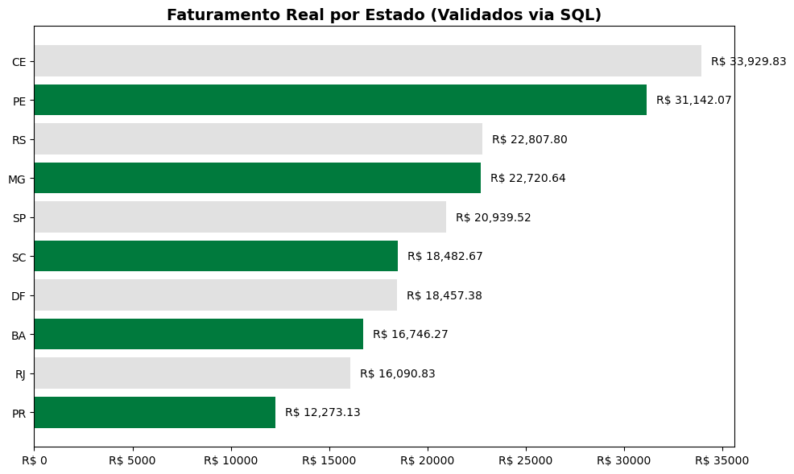

### 🚀 E-commerce & Logística com PostgreSQL

Este repositório reúne meus estudos práticos de banco de dados, simulando o backend e a análise de dados de um sistema de vendas. 

### 📂 O que tem aqui?

Modelagem: Criação de tabelas com relacionamentos (1:N, N:N) e normalização. 

Queries Analíticas: Scripts SQL para calcular Faturamento e Ticket Médio por Estado.

### 💡 Desafios que resolvi:

Limpeza: Como tratar dados de vendas com status "Cancelado" ou "Pendente". (Em andamento)

Performance: Uso de EXPLAIN para identificar consultas lentas e otimizá-las. 

Insights: Transformar linhas de código em respostas sobre onde a empresa está vendendo mais. (Em andamento)

### 🛠️ Tecnologias

PostgreSQL (Banco principal)

MySQL (Projetos anteriores) 

---------------------------------------------------------------------------------------------------------------------------

### Próximos Passos: Integrar esses dados com Python (Pandas) para automação de limpeza e criação de dashboards. 
### Esse projeto como um todo, ainda está em andamento. 
----------------------------------------------------------------------------------------------------------------------------

### 🐍Etapa 2: Tratamento e Gráficos com Python
Nesta fase, meu objetivo foi sair do banco de dados e aprender a manipular os dados usando Python. Como estou no início da minha jornada, utilizei o Chat Lateral (AI Agent) do VS Code para me ajudar a escrever os códigos de forma mais rápida e eficiente.

### O que eu fiz:

Aceleração com IA: Em vez de digitar cada linha do zero, usei prompts para gerar a base do código, o que reduziu consideravelmente meu tempo de trabalho e me permitiu focar na lógica da análise.

Configuração de Ambiente: Aprendi a criar um ambiente .conda e a instalar bibliotecas como Pandas e Matplotlib via terminal quando a IA identificava que elas faziam falta.

Validação de Dados: Usei comandos como df.info() e df.groupby() para garantir que o código gerado pela IA estava entregando os mesmos R$ 108.612,07 do Ceará que eu já tinha validado no SQL.

Visualização: Com o apoio da IA, personalizei as cores e rótulos dos gráficos para criar uma apresentação visual clara para o projeto.

O que aprendi: A IA é um excelente "copiloto", mas eu precisei entender a estrutura do Python para saber onde colar o código, como corrigir erros de NameError e como salvar meus arquivos em JSON para garantir a segurança dos dados.

-------------------------------------------------------------------------------------------------------------------------------------------------------------------------------------------

### Durante o projeto, vi que havia dados cruzando os resultados do Python com o PostgreSQL. Identifiquei uma divergência inicial causada por pedidos cancelados presentes no CSV. Após aplicar filtros de status no Pandas, os valores foram validados com precisão de 100% em relação ao banco de dados (R$ 33.929,83 para o estado do CE).

## ⚠️ Observações sobre os dados

Durante as análises foi identificada uma atualização em massa no banco em 03/02/2026 que padronizou todos os pedidos como "Pago".

Impactos:
- Métricas de cancelamento e pendência deixaram de ser analisáveis
- Análises foram redirecionadas para faturamento e comportamento de compra

Esse registro foi mantido por transparência e controle de qualidade dos dados.

## Balanceamento de Status de Pagamento

Para permitir análises de conversão, cancelamento e inadimplência,
foi criada uma base simulada com distribuição controlada de status de pagamento.

Objetivo:
- Simular cenários reais de e-commerce
- Permitir análises de taxa de conversão
- Estudar impacto de cancelamentos no faturamento

Distribuição adotada:
- 70% pagos
- 20% cancelados
- 10% pendentes

A base original foi preservada.

## Qualidade de Dados

- Detecção de atualização massiva de status
- Registro da data da inconsistência
- Preservação da base original
- Criação de dataset controlado para análise

### Essa simulação foi realizada exclusivamente para fins analíticos e de estudo.
